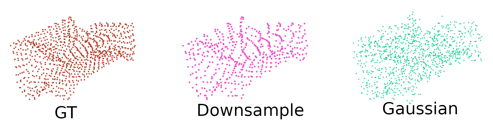

# Representation Learning for point clouds using geometry images

This work was published at [ECCV2022](https://www.researchgate.net/publication/354758865_Feature_Pyramid_Network_Based_Efficient_Normal_Estimation_and_Filtering_for_Time-of-Flight_Depth_Cameras).

This repo contains the code for training the VAE based geometry image generator method, including hyperparameter tuning with [RayTune](https://pytorch.org/tutorials/beginner/hyperparameter_tuning_tutorial.html).

Inside the folder create 'data' and 'results' folders.

Set up the parameters in the main.py file, and in the hyperparam.ini.
Set 'ray' to True, and modify the parameters in the main.py file: (find the line starting with 'if args.ray:')

## Setup
We recommend using conda environment, for that you can use the environment.yml file. You have to [install pytorch separately](https://pytorch.org/get-started/locally/).

## Dataset

You can download the [ModelNet dataset](https://modelnet.cs.princeton.edu/), and then convert it to gim images using https://github.com/sinhayan/learning_geometry_images with Matlab.

Or use the [preconverted dataset](https://drive.google.com/drive/folders/1WSO5EysAak148_HufngGzvbRMCr9CjQ6?usp=sharing)

The conversion between depth images, point clouds and geometry images can be seen here:


## Training and Testing

Run  ```python main.py --name=my_model``` 

To test it, run ```python testing.py --name=my_model --checkpoint_dir=results/my_model/``` 

Example of the generated point clouds ca be see here, where multiple image sizes were comparised. We present the best performing model after tuning.


##  Comparison

We compared our method to [Adversarial Autoencoders for Compact Representations of 3D Point Clouds](https://arxiv.org/abs/1811.07605) method, which uses point clouds.

To compare the two methods we have used the Chamfer Distance and runtime.

For comparing the chamfer distances we defined 4 cases:

-without noise (the same data as in the training)

-gaussian noise (with mean=0, and standard deviation = 5cm)

-downsampling with zero (every second point/pixel becomes 0, since both methods require a defined size of input data, we cannot delete points/pixels)

-downsampling with copy (every second point/pixel is equal to the previous value)



| Noise type  | Our | 3d-AAE |
| ------------- | ------------- | ------------- |
| Without noise | 9.6 | 3.8 |
| Gaussian noise (~5cm) | 9.7 | 11.5 |
| Gaussian noise (~7.5cm) | 9.8 | 22.2 |
| Gaussian noise (~10cm) | 10 | 37.38 |

Concerning the runtime (the test were conducted on A100 cards from Nvidia, and on a Jetson NX):

| -  | Our | 3d-AAE |
| ------------- | ------------- | ------------- |
| Time (on server) | 0.9 ms | 1.3 ms |
| Time (on Jetson NX) | 5.4 | 12.5 |

## Citations
### Citing this work
If you find our code / paper / data useful to your research, please consider citing:

```bibtex
@InProceedings{molnar2023representationlearningpcd,
  author    = {Szil{\'{a}}rd Moln{\'{a}}r and Levente Tam{\'{a}}s},
  booktitle = {{Computer Vision - {ECCV} 2022 Workshops - Tel Aviv, Israel, October 23-27, 2022, Proceedings, Part {VI}}},
  title     = {{Representation Learning for Point Clouds with Variational Autoencoders}},
  year      = {2022},
  editor    = {Leonid Karlinsky and Tomer Michaeli and Ko Nishino},
  pages     = {727--737},
  publisher = {Springer},
  series    = {Lecture Notes in Computer Science},
  volume    = {13806},
  doi       = {10.1007/978-3-031-25075-0\_49},
}
```

## Acknowledgment

This repo was based on the work [Disentangled VAE](https://github.com/YannDubs/disentangling-vae).
Further support was given by: KTMA (Kárpát-medencei Tehetségkutató Alapítvány) and National Authority for Scientific Research, CNCS-UEFISCDI
