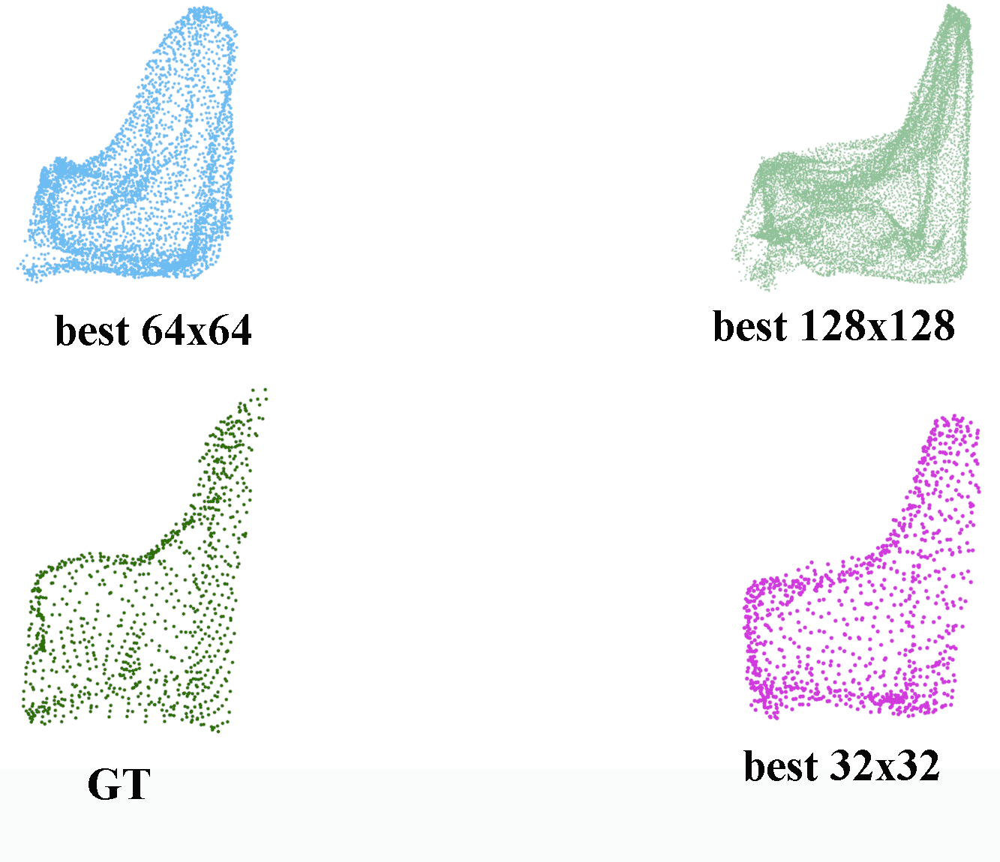
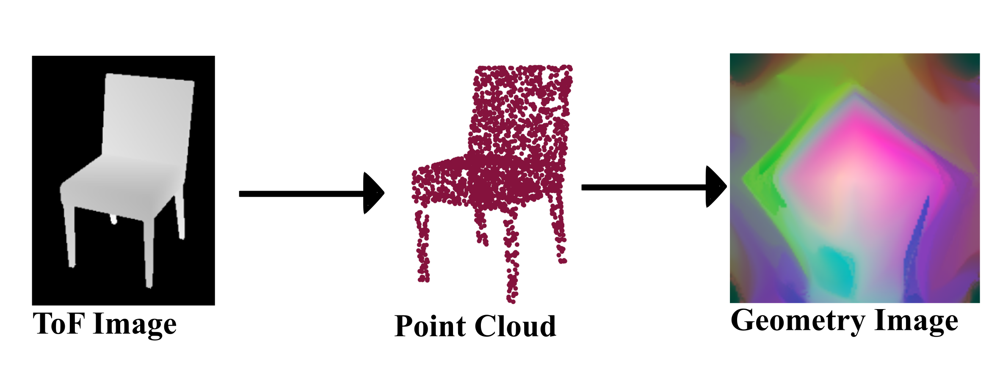

Representation Learning for point clouds using geometry images

This repo contains the code for training the VAE based geometry image generator method, including hyperparameter tuning with RayTune.

Inside the folder create 'data' and 'results' folders.

In hyperparam.ini you can configure the parameters.

To use ray_tune, install the package, and set up the parameters in the main.py file.

Download the ModelNet dataset, convert it to gim images
You can use https://github.com/sinhayan/learning_geometry_images with matlab to do it.
Set up the path to it.

Run main.py to train

To test it, run testing.py file. 

Example of the generated point clouds ca be see here, where multiple image sizes were comparised

The conversion between depth images, point clouds and geometry images can be seen here:

